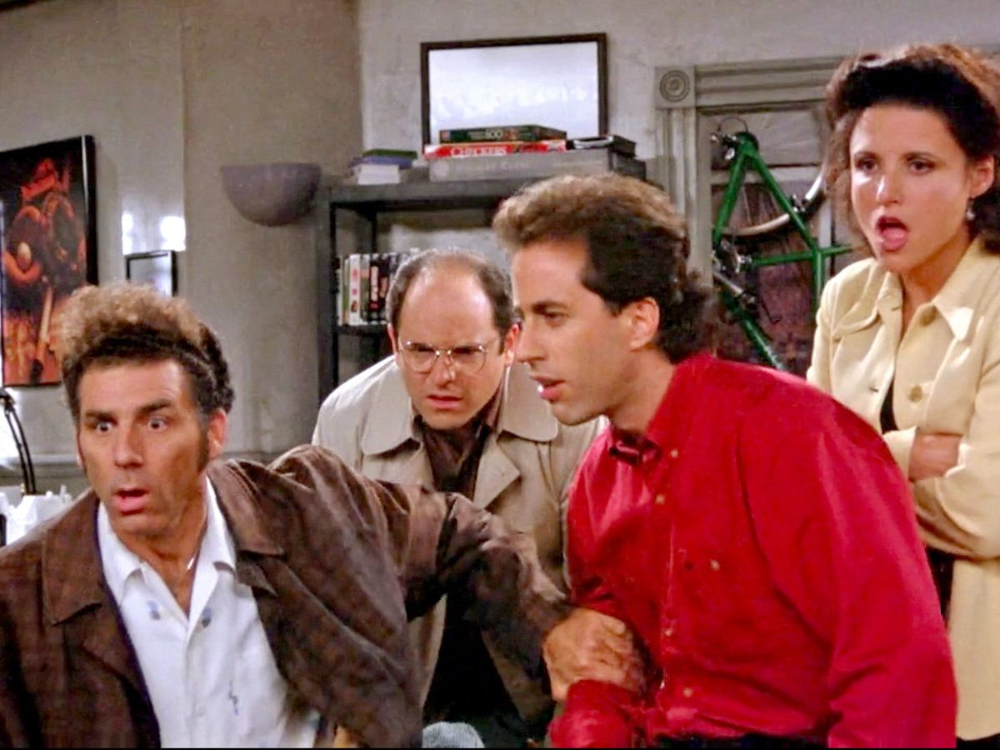

```{r include = FALSE}
knitr::opts_chunk$set(echo = TRUE,
                      message = FALSE, 
                      warning = FALSE)
options(kableExtra.html.bsTable = TRUE)

```

# Introdução


O `ggplot2` é um pacote de visualização de dados *open-source* desenvolvido para o R. Criado por Hadley Wickham em 2005, é hoje uma das principais ferramentas de um cientista de dados.


Neste artigo não tenho a pretenção de ensinar a criar visualizações com o ggplot2 (uma boa fonte é o excelente livro [R for Data Science](https://r4ds.had.co.nz/data-visualisation.html)), mas apenas mostrar alguns dos tipos de visualizações que podem ser criadas com o pacote. Para tanto, vamos utilizar alguns dados publicamente disponíveis sobre a série de TV Seinfeld. 




Seinfeld foi uma série de comédia bastante longeva e de muito sucesso na TV americana. Tendo estreiado em julho de 1989, a série foi exibida por 9 temporadas, sem os altos e baixos típicos das séries longas. 

Para entender um pouco do sucesso da série, vamos analisar as notas dadas a cada episódio pelos usuários do Internet Movie Database (IMDb), o mais famoso site de informações sobre cinema, TV, jogos e outras áreas de entretenimento. Como exemplo, a [página episódio 11 da quarta temporada de Seinfeld](https://www.imdb.com/title/tt0697679/?ref_=tt_ep_nx) mostra que cerca de 6400 usuários deram uma nota média de 9,5, uma das mais altas de todo a série.

<br>

# Dados Utilizados

Mas antes de começarmos, vamos carregar os principais pacotes utilizados ao longo da análise:

```{r include=FALSE}
needs::needs(tidyverse, ggridges, viridis, hrbrthemes, showtext, htmlwidgets)
font_add_google("Roboto", "Roboto")
showtext_auto() 
```

Agora podemos carregar os dados disponíveis sobre as notas de Seinfeld no IMDb. Eles estão disponíveis em vários locais da internet, mas estes dados foram baixados especificamente do Kangle [aqui](https://www.kaggle.com/hod101s/seinfeld-imdb-ratings?select=SeinfeldData.csv). 


```{r message=FALSE, warning=FALSE, include=FALSE}

df <- read_csv("archive.zip") %>% 
  mutate(episode = row_number()) 
```

Podemos ver abaixo que o banco de dados contém 172 linhas (episódios), com 7 variáveis: temporada, título do episódio, data da primeira transmissão na tv, nota média no IMDb, a quantidade de usuários que votaram no episódio, a sinópse do episódio e uma variável que indica o número do episódio.

```{r}
df %>% 
  head() %>% 
  knitr::kable()
```

Abaixo, vemos algumas informações sobre a série. Mesmo permanecido por tanto tempo na TV (9 temporadas e mais de 170 episódios), a série conseguiu manter uma qualidade consistente ao longo do tempo, alcançando uma nota média de 8,4 IMDb.


```{r}
df %>% 
  mutate(Airdate = lubridate::dmy(Airdate)) %>% 
  summarise(`Nota Média` = round(mean(Rating),1),
            `Primeiro Episódio` = min(Airdate), 
            `Último Episódio` = max(Airdate),
            `Temporadas` = max(Season),
            `Episódios` = n()) %>% 
  knitr::kable()
```


Mesmo com uma avaliação média tão elevada, é possível imaginar que a série passou por altos e baixos, tendo produzido episódios inesquecíveis, e outros nem tanto. Assim, vamos usar o `ggplot2`para analisar o desempenho da série ao longo dos seus 9 anos de exibição.

<br>

# Gráficos de Classificação

Podemos começar calculando a nota média por temporada. E se o objetivo é encontrar as temporadas com melhor temporada, podemos usar gráficos de classificação como os de barra (`geom_bar`) ou sua versão mais atraente, o lollipop.


## Gráfico de barras

```{r}
df %>% 
  group_by(Season) %>% 
  summarise(nota_media = mean(Rating)) %>% 
  ggplot(aes(x = as.factor(Season), y = nota_media, color = as.factor(Season))) + 
  geom_point(size = 8) +
  geom_segment(aes(x=as.factor(Season), xend=as.factor(Season), y=0, yend=nota_media),
               size = 4) +
  #geom_hline(yintercept = mean(df$Rating), linetype = 5, color = "grey10", size = 1) +
  theme_ipsum(base_family = "Roboto", base_size = 22) +
  labs(title = "Seinfeld, Nota Média por Temporada", y = "Nota Média", x = "Temporada",
       caption = "Fonte: IMDb") +
  geom_label(aes(label = round(nota_media, 1)), nudge_y = 2.0) +
  theme(legend.position = "none")  + 
  coord_flip()

```
A série começou bastante desacreditada, com apenas 5 episódios sendo encomendados para sua primeira temporada, e apesar de um início abaixo da média, as temporadas seguintes elevaram o nível da série, com notas médias sempre acima de 8,0.


## Gráfico de Nuvens

Outra forma de classificar informação é utilizando gráficos em nuvens. Este tipo de visualização é útil quando queremos mostrar a frequência com que palavras aparecem em textos.

Aqui vamos precisar contar o número de palavras na sinopse dos episódios. Para isso, podemos utilizar a função `unnest_tokens` do pacote `tidytext`, que permite separar as colunas de textos (Description, no nosso caso) em uma tabela de palavras (uma linha por palavra). 

Quando trabalhamos com texto, é sempre boa prática eliminar aquelas palavras vazias, que não adicionam nenhum tipo de informação (*the, in, on, if, when, etc*). Para tanto, utilizamos o `anti_join(stop_words)`.

```{r}
needs::needs(tidytext, wordcloud2)

palavras_seinfeld <- df %>% 
  unnest_tokens(word, Description) %>% 
  anti_join(stop_words) %>% 
  mutate(word = str_replace(word, "\'s", "")) %>% 
  count(word, sort = TRUE)


palavras_seinfeld %>% head() %>% knitr::kable()
```

Como esperado, as palavras mais comuns nas sinopses dos episódios são os nomes dos quatro personagens principais da série: Jerry, George, Elaine e Kramer. Vamos ignora-las e exibir as demais palavras mais comuns:


```{r fig.height=12}
set.seed(123)
palavras_seinfeld %>% 
  filter(!word %in% c("jerry", "george","elaine", "kramer")) %>% 
  wordcloud2(size = 1.6, backgroundColor = "black")
```


Susan (19 menções) é uma importante personagem secundária na série, assim como Newman (14 menções). A palavra "decide" surge 23 vezes, indicando que vários episódios giram em torno de personagens tomando algum tipo de atitude. "Woman" surge 19 vezes, em razão dos vários episódios onde Jerry e George tentam encontrar o amor das suas vidas. Outra palavra bastante citada é "job", provavelmente relacionada aos episódios onde George busca um emprego.

A sinópse é bastante interessante, mas estamos perdendo informações cruciais sobre a série nos baseando apenas nelas. Vamos mais fundo na análise de Seinfeld utilizando uma base de dados de todas as falas dos personagens ao longo da série. A base de `scripts` (que pode ser encontrada [aqui](https://www.kaggle.com/thec03u5/seinfeld-chronicles?select=scripts.csv)) ofecece cada dialogo falado por cada personagem em todos em cada episódio da série. 


```{r message=FALSE, warning=FALSE}
script <- read_csv("scripts.csv.zip") %>% select(-X1)
script %>% head(2) %>% knitr::kable()
```

Acima, vemos a primeira aparição de Jerry Seinfeld, no show que leva seu nome, contando alguma piada sobre roupas em dos seus shows de stand-up. O resto da base representam mais de 54 mil dialogos trocados entre os múltiplos personagens que passaram pela história da série.

```{r}
script %>% 
  summarise(`Total de falas` = n(),
            `Total de Personagens` = n_distinct(Character))
```

Para tornar o gráfico de nuvens mais interessante, vamos gerar a núvem para um dos personagens principais: Elaine. Para tornar a visualização mais fácil, vamos limitar apenas para palavras mencionadas mais de 40 vezes.


```{r}


nuvem_personagem <- function(personagem = "JERRY") {
  palavras <- script %>% 
  filter(Character == personagem) %>% 
  unnest_tokens(word, Dialogue) %>% 
  anti_join(stop_words, by = "word") %>% 
  mutate(word = str_replace(word, "\'s", "")) %>% 
  count(word, sort = TRUE) %>% 
  filter(!word %in% c("Yeah", "Ah", "Uh",
                      "yeah", "hey", "ya", "gotta", "gonna","didnt",
                      "alright", "youre", "im", "ah", "wanna", "ive")) %>% 
  filter(n > 40)
  


palavras %>% 
  wordcloud2(size = 1.6, backgroundColor = "black")

}

nuvem_elaine <- nuvem_personagem("ELAINE")

saveWidget(nuvem_elaine,"tmp.html",selfcontained = F)
webshot::webshot("tmp.html","elaine.png", delay =5, vwidth = 480, vheight=480)

```

(*Por alguma razão `wordclou2` tem um [bug bem estranho](https://github.com/Lchiffon/wordcloud2/issues/60) que não permite a visualização de mais que uma núvem na mesma página. Por isso, essas últimas visualizações são estáticas e exibidas como imagens.*)

Nuvens de palavras são simples de entender e tendem a ser visualmente interessantes. Contudo elas podem ser problemáticas por várias razões: primeiro, porque o número de letras de uma palavra pode torna-la maior do que deveria; segundo, porque pode ser difícil distinguir visualmente duas palavras com frequências próximas. Compare "Car" com 17 menções, a "Newman" (com 14), onde o segundo parece muito maior que o primeiro. 

Em contextos mais formais, vale mais a pena o uso de gráficos de barras ou lollipop. Como, por exemplo, a quantidade de vezes que os personagens mencionam "coffee":


```{r}
script %>% 
  unnest_tokens(word, Dialogue) %>% 
  filter(str_detect(word, "coffee|Coffee")) %>% 
  group_by(Character) %>% 
  tally() %>% 
  filter(Character %in% c("ELAINE", "GEORGE","JERRY","KRAMER")) %>% 
  ggplot(aes(x = fct_reorder(Character, n), y = n, color = Character)) +
  geom_point(size = 8) +
  geom_segment(aes(x=as.factor(Character), xend=as.factor(Character), y=0, yend=n),
               size = 4) +
  #geom_hline(yintercept = mean(df$Rating), linetype = 5, color = "grey10", size = 1) +
  theme_ipsum(base_family = "Roboto") +
  labs(title = "Seinfeld, Menções a Café por Personagem", y = "Menções", x = "Personagem",
       caption = "Fonte: IMDb") +
  theme(legend.position = "none")  + 
  coord_flip()
  
  
```


<br>

# Correlação

Com os gráficos de correlação o objetivo é visualizar como duas ou mais variáveis se relacionam. 


## Gráfico de dispersão por temporada

Podemos utilizar um gráfico de dispersão de notas por temporada para verificar a relação entre temporada e notas dos episódios. Podemos observar se os epísodios se tornaram melhores com o passar do tempo.

```{r fig.height=6, message=FALSE, warning=FALSE}
df %>% 
  ggplot(aes(x = episode, y = Rating, color = as.factor(Season))) +
  geom_point() + 
  geom_smooth() +
  theme_ipsum(base_family = "Roboto", base_size = 24) +
  labs(title = "Seinfeld, Notas dos Por Episódio", y = "Nota", x = "Episódio", color = "Temporada", caption = "Fonte: IMDb") +
  geom_hline(yintercept = mean(df$Rating), linetype = 5, color = "grey2", size = 1) +
  annotate("label", label = "Nota média: 8.4", x = 6, y = 9) +
  #geom_label(aes(label = as.factor(Season))) +
  theme(legend.position = "bottom")

```


Acima usamos um gráfico de dispersão (`geom_point`) em conjunto com uma gráfico de tendência/ajuste (`geom_smooth`). Com eles observamos as notas dos episódios dentro de cada temporada.

Para facilitar a comparação, inclui uma linha tracejada com a nota média de toda a série (de 8,4), facilitando algumas comparações. Por exemplo, a primeira temporada foi consistentemente abaixo da média; a quinta temporada teve um final arrebatador; enquanto que as temporadas 6, 7 e 8 seguraram bem a qualidade. Já a final da última temporada parece ter desapontado a maioria dos fãs, ficando abaixo da média histórica.

Alternativamente, podemos estar interessados se existe uma relação entre o total de falas de cada personagem e a nota do episódio.

Para tanto, vamos unir a base de dialógicos com a base de notas por episódio:


```{r}
aparicoes_episodio <- script %>% 
  group_by(SEID, Character) %>% 
  summarise(n = n()) %>% 
  filter(!is.na(Character))

aparicoes_notas <- df %>% 
  group_by(Season) %>% 
  mutate(Episode_Season = row_number()) %>% 
  ungroup() %>% 
  mutate(SEID = paste0("S", str_pad(Season, 2, pad = "0"),"E", str_pad(Episode_Season, 2, pad = "0"))) %>%
  select(SEID, Rating, episode, Season) %>% 
  left_join(aparicoes_episodio, by = "SEID")

aparicoes_notas %>% 
  arrange(desc(n)) %>% 
  head() %>% 
  knitr::kable()

```

Agora podemos criar um gráfico para os principais personagens da série: Jerry, George, Elaine, Kramer, Newman, e os pais de Jerry (Morty e Helen), que são os personagens com mais falas na série.


```{r fig.height=8, message=FALSE, warning=FALSE}

personagens_mais_mencionados <- aparicoes_notas %>% 
  group_by(Character) %>% 
  summarise(falas = sum(n)) %>% 
  arrange(desc(falas)) %>% 
  top_n(falas, n = 7) %>% 
  pull(Character)


aparicoes_notas %>% 
  filter(!is.na(Character)) %>% 
  filter(Character %in% personagens_mais_mencionados) %>% 
  ggplot(aes(x = n, y = Rating, color = as.factor(Character))) +
  geom_point() +
  geom_smooth() +
  guides(color = FALSE) +
  facet_wrap(~Character, scales = "free_x", ncol = 2) +
  theme_ipsum(base_family = "Roboto", base_size = 24) +
  labs(y = "Nota", x = "Falas durante o episódio", title = "Seinfeld, Relação entre total de falas do personagem e Nota do Episódio", caption = "Fonte: IMDb") +
  theme(legend.position = "none")
```

Jerry, George, Elaine e Kramer aparecem na grande maioria dos episódios, de modo que é difícil enxergar uma relação entre o total de falas do personagem e a nota dos episódios. Morty, Helen e Newman são personagens que surgem esporadicamente, então a adição ou não dos personagens poderia revelar algo mais interessante, mas também não parece ser o caso. Acredito que é uma boa notícia: a série é consistemente bem avaliada independente do elenco do episódio e do personagem em foco.


## Gráfico de Calor

Os gráficos de anteriores são muito bons em mostrar o comportamento médio, mas se tivermos interessados em encontrar os melhores episódios individuais podemos utilizar visualizações como o gráfico de calor (ou heatmap).

Gráficos de calor são uma boa alternativa para identificar *outliers*, como episódios muito acima da média. A figura abaixo mostra 4 destes episódios (em amarelo). Podemos também idenficar aqueles episódios que deixaram a desejar, buscando os pontos mais escuros do gráfico (como o final da última temporada e episódio 4 da terceira temporada).


```{r fig.height=6}
df %>% 
  group_by(Season) %>% 
  mutate(Episode_Season = row_number()) %>% 
  ungroup() %>% 
  ggplot(aes(x = Episode_Season, y = as.factor(Season), fill = Rating)) +
  geom_tile() + 
  scale_fill_viridis() +
  theme_ipsum(base_family = "Roboto") +
  labs(title = "Seinfeld, Notas por Episódio", 
       y = "Temporada", x = "Episódio", color = "Temporada", caption = "Fonte: IMDb", fill = "Nota:") +
  theme(legend.position = "bottom")
  
```

Se bateu a curiosidade para saber quais são os melhores episódios, segue a lista abaixo:


```{r}
df %>% 
  group_by(Season) %>% 
  mutate(Episode_Season = row_number()) %>% 
  ungroup() %>% 
  slice_max(order_by = Rating, n = 4) %>% 
  select(Episode_Season, Season, Title, Rating) %>% 
  knitr::kable()
```

<br>

# Gráficos de Distribuição

Quando o objetivo é visualizar a distribuição de uma variável, podemos sempre recorrer ao bons e velhos histograma (`geom_histogram`), gráficos de densidade (`geom_density`) ou boxplot (`geom_boxplot`). Ou podemos ser mais criativos, utilizando o gráfico de violino (`geom_violin`) e o ridgeline (`ggridges::geom_density_ridges`).


## Histograma

Sem muito segredos, o histograma mostra a frequência de falas ao longo dos episódios. Como as notas representam dados contínuos, podemos separar os valor por faixas de valores (`bins = 10`). Nenhuma surpresa, Jerry  e George tem bem mais falas em média que Kramer e Elaine. Newman aparece esporadicamente, mas sempre com pequenas participações (no máximo 40 falas). Enquanto que Helen e Morty, por serem um casal, possuem distribuições bem próximas, mas exibindo, alguns episódios com elevada presença (100 falas no caso de Morty).


```{r fig.height=8}
aparicoes_notas %>% 
  filter(Character %in% personagens_mais_mencionados) %>% 
  ggplot(aes(x = n, fill = Character)) +
  geom_histogram() +
  facet_wrap(~Character, scale = "free_x", ncol = 2) +
  theme_ipsum(base_family = "Roboto", base_size = 24, plot_title_size = 24) +
  labs(title = "Seinfeld, Fala dos Personagens", y = "", x = "") +
  theme(legend.position = "none")

```


## Gráfico de densidade

Alternativamente ao histograma, outro gráfico de densidade é a densidade kernel. Podemos exibir seu uso com uma distribuição simples de notas por temporada. Da mesma forma que no histograma acima, podemos mostrar a densidade de cada temporada como uma faceta (`facet_wrap`), ou podemos ser criativos e usar um `ridgeline`. Esta última permite exibir densidades por grupos em uma mesma visualização, com um visual bem charmoso de montanha.

```{r}
df %>% 
  ggplot(aes(x = Rating, y = as.factor(Season), fill = ..x..)) +
  geom_density_ridges_gradient(scale = 3, rel_min_height = 0.01) +
  scale_fill_viridis(name = "Nota", option = "C") + 
  labs(title = "Seinfeld, Nota por Temporada", y = "Temporada", x = "Nota", caption = "Fonte: IMDb")  +
  theme_ipsum(base_family = "Roboto", base_size = 24) +
  theme(legend.position = "none",
        panel.spacing = unit(0.1, "lines"))

```


## Boxplot

Boxplot (ou diagrama de caixas) é um gráfico bem completo, pois exibe de uma vez só a nota mediana por temporada, a amplitude interquartil e os valores discrepantes.

Como o gráfico de calor, ele permite identificar episódios que se destacaram positivamente, como os 4 discutidos acima, ou negativamente, como um dos episódios da 6ª temporada, que ficou bem abaixo da média da temporada.

O boxplot ainda exibe a amplitude interquartil, o que nos permite avaliar o quão consistente uma temporada é, como a quinta e a última temporada, que teve altos e baixos.

```{r}
df %>% 
  ggplot(aes(x = Rating, y = as.factor(Season), fill = as.factor(Season))) +
  geom_boxplot() +
  #facet_wrap(~Season) +
  theme_ipsum(base_family = "Roboto", base_size = 24) +
  labs(title = "Seinfeld, Notas por Temporada", y = "Temporada", x = "Nota",
       caption = "Fonte: IMDb") +
  theme(legend.position = "none") + 
  coord_flip()

```


A mesma visualização de boxplot pode ser usada para exibir o total de falas por episódio. Para não repetir o mesmo tipo de informação, vamos construir o total de falas por cada temporada.

```{r fig.height=8}
aparicoes_notas %>% 
  filter(Character %in% c("JERRY", "GEORGE", "ELAINE", "KRAMER")) %>% 
  ggplot(aes(x = n, y = Character, fill = Character)) +
  geom_boxplot() +
  theme_ipsum(base_family = "Roboto", base_size = 24) +
  labs(title = "Seinfeld, Fala dos Personagens por Temporada", y = "", x = "") +
  theme(legend.position = "none") +
  facet_wrap(~Season, scale = "free_y") 

```


É possível notar que Jerry consistentemente possui mais falas ao longo das 9 temporadas da série, enquanto que a participação dos demais é mais balanceada, principalmente a partir da sexta temporada.

Podemos repetir a mesma visualização pra os personagens secundários, mas agora utilizando um gráfico de violino. A interpretação desse gráfico é a mesma do gráfico boxplot (ele exibe mediana, e o 1º e 3º quartis, além de valores discrepantes).

É possível notar que apenas a partir da terceira temporada esses personagens se tornaram peça recorrente da série, com destaque para a quinta temporada.


```{r fig.height=8}
aparicoes_notas %>% 
  filter(Character %in% c("MORTY", "HELEN", "NEWMAN")) %>% 
  ggplot(aes(x = n, y = Character, fill = Character)) +
  geom_violin() +
  theme_ipsum(base_family = "Roboto", base_size = 24) +
  labs(title = "Seinfeld, Fala dos Personagens por Temporada", y = "", x = "") +
  theme(legend.position = "none") +
  facet_wrap(~Season, scale = "free_y", ncol = 2) 

```

<br>

# Conclusão

O `ggplot2` é um pacote de visualização bem robusto no R. Ele ainda oferece uma infinidade [de outros tipos de visualizações](https://www.r-graph-gallery.com/), mas aqui foquei nas principais visualizações, e aquelas que os dados permitiam produzir. 

Para além do ggplot2, uma série de [extensões](https://exts.ggplot2.tidyverse.org/gallery/) foram desenvolvidas pela comunidade, o que permite a criação de praticamente qualquer visualização imaginada, o que inclui criar gráficos com temas do [Bob Sponja](https://github.com/Ryo-N7/tvthemes).
